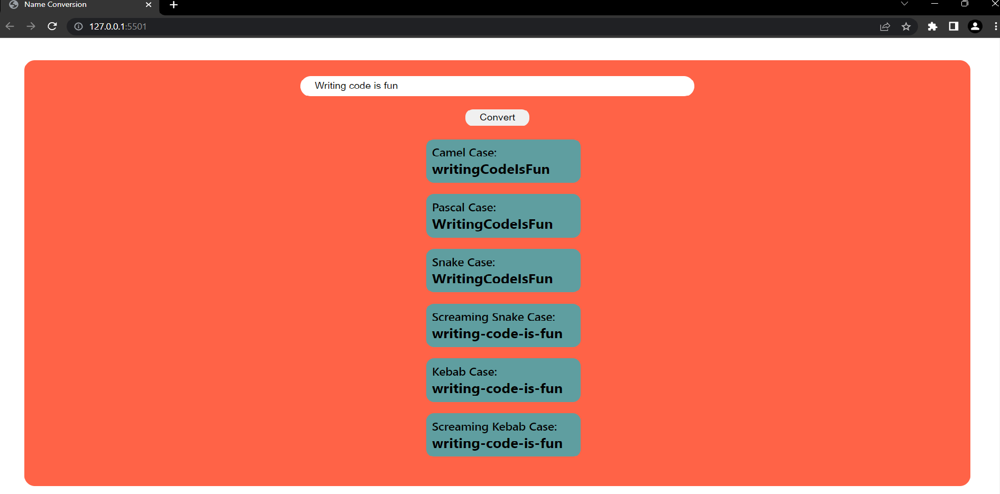

# Name Conversion
***
### In this I have tried to convert the input given by the user into different *<b>Naming Convention</b>* using core  ***JavaScript***.

Different Naming Convention 

1. Camel-Case
1. Pascal Case
1. Snake Case
1. Screaming Snake Case
1. Kebab Case
1. Screaming Kebab Case

*****
# Output

***
## [Linkedin-Manish](www.linkedin.com/in/manish-kumar-b0639a170)
## [FindCoder-Manish](https://www.findcoder.io/u/itmanishsingh)
